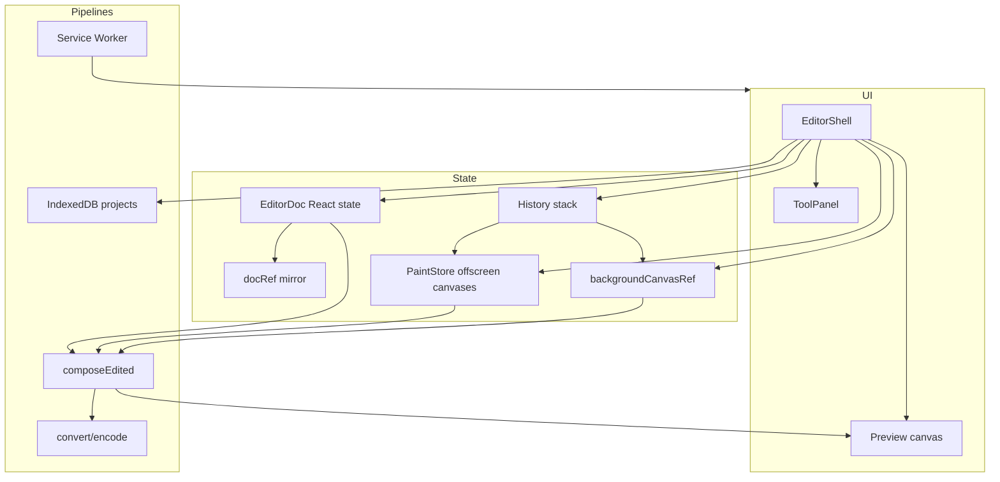

# Architecture

How Lumen is put together. Read this before changing editor core behavior.

## High-level diagram



## Entry points

| Entry | Role |
| --- | --- |
| `app/page.tsx` | Renders `EditorShell` |
| `app/layout.tsx` | Fonts, metadata, PWA icons, `ClientBootstrap` |
| `components/editor/editor-shell.tsx` | **Orchestrator** — almost all editor behavior |

If you are hunting a bug in tools, history, crop, or save: start in `editor-shell.tsx`.

## Document model (`EditorDoc`)

Defined in `lib/editor-types.ts`.

```
EditorDoc
  width, height
  adjustments { brightness, contrast, saturation, rotate, flipH, flipV }
  crop: CropRect | null   // usually null after Apply (crop is baked)
  layers: EditorLayer[]   // index 0 = bottom = background
  activeLayerId
```

Layer kinds:

| Kind | Pixels | Notes |
| --- | --- | --- |
| `background` | Source image or baked canvas | Always stay at index `0` |
| `paint` | `PaintStore` canvas by layer id | Brush / clear selection |
| `text` | Metadata only | x, y, font, color, **rotation** |

## Compose pipeline

`lib/compose.ts`:

1. `drawDocumentFlat` — draw bg + paints + texts in document space  
2. Optional crop region  
3. CSS-like filter (brightness/contrast/saturation)  
4. Rotate + flip around center  
5. Result size from `outputSize` (swap w/h on 90°/270°)  

Preview options used by the shell:

- Crop mode: `ignoreCrop` + `forceIdentityTransform` so the crop UI matches pixels  
- Normal mode: full adjustments  

Export calls the same compose, then `encodeImage`.

## Pointer mapping

Preview pixels are in **output** space (after rotate/flip). Document tools need **doc** space.

`lib/pointer-math.ts`:

- `outputPointToDoc` — click → document  
- `docPointToOutput` / `docRectToOutputBounds` — overlays  

`EditorShell.clientToDoc` wraps this using the same flags as compose.

**Never** map clicks with `clientX / canvasCssWidth * doc.width` alone when rotate/flip may be active.

## History

`lib/history.ts` + shell `captureSnapshot` / `commitSnapshot` / `restoreSnapshot`.

Each snapshot:

```
{
  doc: EditorDoc clone,
  paintData: { [paintLayerId]: pngDataUrl },
  backgroundDataUrl: string | null  // when background was destructively edited
}
```

Limit: `HISTORY_LIMIT` (40). Memory scales with image size × layers × depth.

Concurrency: `historyOpRef` token ignores stale async restores.

## Paint store

`lib/paint-store.ts` — `Map` of offscreen canvases.

- `ensure(id, w, h)` create/resize  
- `capture(ids)` → data URLs for history  
- `restoreAll` on undo  

Brush and clear-selection mutate these canvases directly, then `redrawPreview()` or rely on React compose effect.

## Background mutations

Destructive ops clone/bake into `backgroundCanvasRef`:

- Red-eye  
- Heal / clone stamp  
- Apply crop / apply resize  

`getBackground()` returns that canvas or the original `HTMLImageElement`.

## Conversion

```
File → decodeToImage (heic2any if HEIC)
     → canvas pixels
     → encodeImage(format)
```

| Format | Encoder |
| --- | --- |
| PNG/JPEG/WebP | `canvas.toBlob` |
| AVIF | `canvas.toBlob('image/avif')` (Chromium) |
| HEIC | `elheif` WASM HEVC (`lib/convert/heic-encode.ts`) |

EXIF: `lib/convert/exif.ts` — JPEG full (Orientation forced to `1` after bake); PNG/WebP best-effort; AVIF/HEIC pixels only.

Batch: `components/editor/batch-convert-panel.tsx` + `jszip`.

## Offline

| Piece | Path |
| --- | --- |
| SW | `public/sw.js` |
| Register | `lib/register-sw.ts` |
| IDB wrapper | `lib/offline/idb.ts` |
| Project CRUD | `lib/offline/projects.ts` |
| Capture/persist | `lib/offline/project-io.ts` |

Auto-save ~1.8s after commits. Save uses a mutex and pre-assigns `projectId` to avoid duplicates.

## Page Agent

```
User question → heuristics (always)
              → optional POST /api/page-agent (LLM JSON)
              → highlight data-lumen-id targets
              → optional lumen:goto-panel event
```

Tagged UI: `data-lumen-id` / `data-lumen-label` on controls.

## UI layout

- **Desktop (≥1024px):** canvas + sticky `ToolPanel` aside  
- **Mobile:** canvas + fixed bottom sheet with tabs + compact `ToolPanel`  
- Only **one** panel instance mounts (`matchMedia`)  

## Design tokens

`app/globals.css` — CSS variables and `.lumen-*` utilities. See [UI & design system](./ui-design-system.md).

## Related

- [Developer guide](./developer-guide.md)  
- [Code map](./code-map.md)
